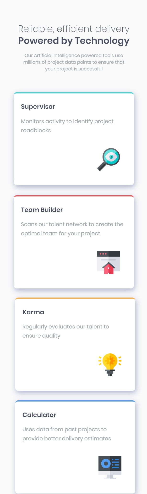
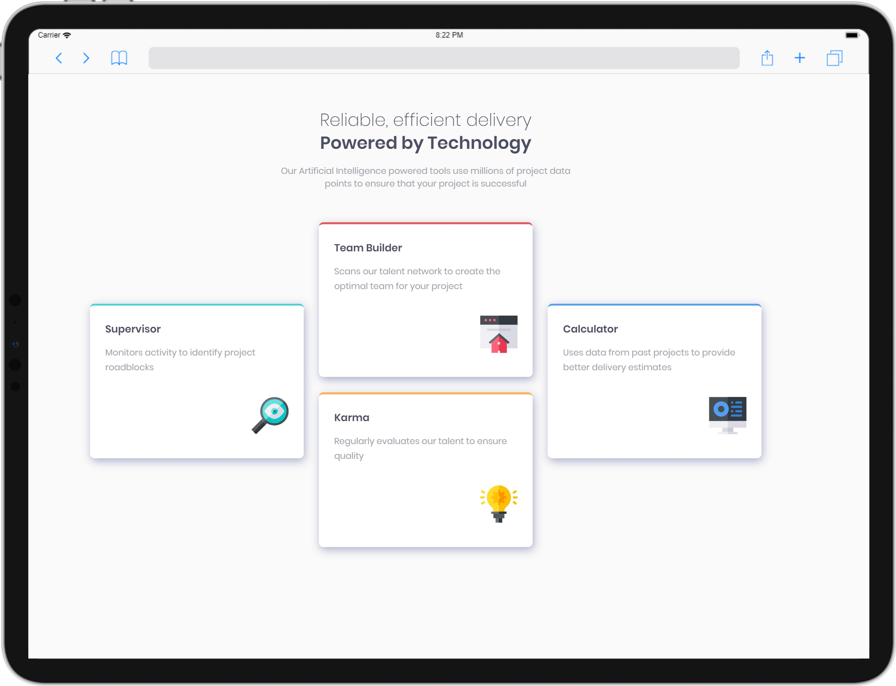
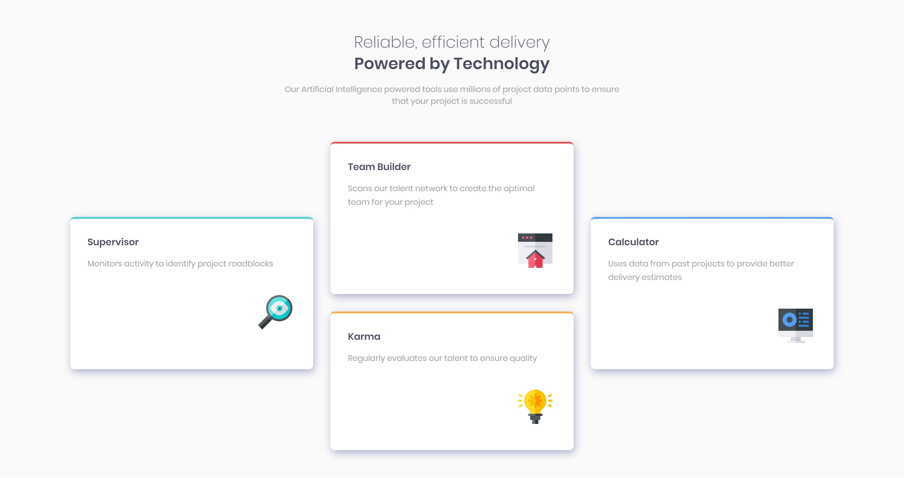

  <a href="#introduction">Introduction</a>&nbsp;&nbsp;&nbsp;|&nbsp;&nbsp;&nbsp;
  <a href="#objectives-of-the-project">Objectives</a>&nbsp;&nbsp;&nbsp;|&nbsp;&nbsp;&nbsp;
  <a href="#gear-technical-components">Technical Components</a>&nbsp;&nbsp;&nbsp;|&nbsp;&nbsp;&nbsp;
  <a href="#bookmark-attribution">Attribution</a>&nbsp;&nbsp;&nbsp;|&nbsp;&nbsp;&nbsp;
  <a href="#camera_flash-screenshots-of-responsive-design">Screenshots</a>&nbsp;&nbsp;&nbsp;|&nbsp;&nbsp;&nbsp;
  <a href="#memo-license">License</a>

## Four Card Feature Section

## 👋 Welcome!

Thanks for checking out this project.

This project was build on purely HTML and CSS.

## Introduction

The Four Card Feature Section is a small project for practicing layouts and responsive design skills in CSS.

This project was obtained from a list of challenges by Frontend Mentor.

## :pushpin: Objectives of the project

* Use as much semantic HTML5 markup. *Manage code readability, accessibility and SEO optimization of web page.*

* Style with reusable CSS classes. 

* Use responsive design to make the page compatible on screen across mobile and desktop devices.

* Keep the code as clean as possible.

And most important of all, _**Happy coding!🚀**_

## :gear: Technical Components

* Flexbox

* Media queries used to build the responsive design

## :bookmark: Attribution

[Responsive design testing app by Sizzy](https://a.paddle.com/v2/click/49831/114619?link=1947/ "Sizzy.co")

## :camera_flash: Screenshots of Responsive Design

#### Phone (Galaxy S9+ @ 412 x 846)

#### Tablet (iPad Pro 12.9 with device frame in landscape view @ 1024 x 1366)

#### Laptop (Macbook Pro 15 @ 1680 x 1050)

## :memo: License
This project is licensed under the terms of the MIT license. For more information, please refer to the license [documentation](LICENSE.md).
